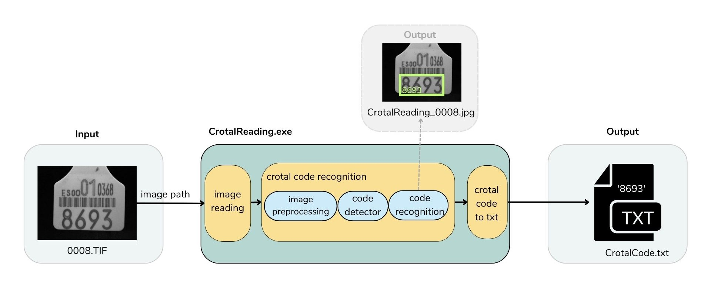
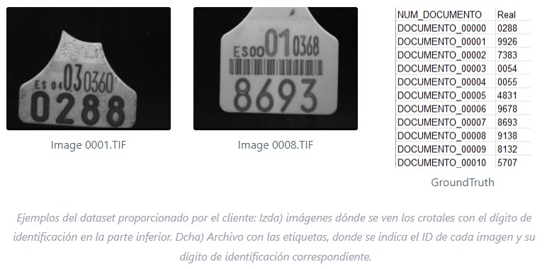

# Reconocimiento de dígitos en imágenes de crotales
:woman_student: Proyecto para la asignatura ‘Aplicaciones Industriales y Comerciales de la Visión Artificial’ del Máster Universitario en Visión Artificial de la URJC, impartida entre enero y abril de 2023.

[Project AIVA_2023-Crotales](https://github.com/users/celiagarcia/projects/1/views/5?layout=board) para ayudar a planificar y hacer seguimiento del trabajo.

## Descripción
Dentro del actual *Sistema de Identificación de Vacunos*, se nos pide la implementación de una solución que mejore el rendimiento de lectura de códigos de identificación animal, leyendo los códigos a partir de unas imágenes de entrada y los retorne como código numérico.

Este proyecto consiste en desarrollar dicha aplicación, que llamaremos **CrotalReading.exe**, para el reconocimiento de dígitos situados en la parte inferior de los crotales de ganadería vacuna, con ayuda del dataset proporcionado por el cliente.

Esta aplicación será integrada en el actual *Sistema de Identificación de Vacunos* para que en lugar de realizar la lectura de crotales actual, realice la llamada a la aplicación CrotalReading.exe, lea el código de la imagen del crotal y este código se proporcione a su programa de Visual Basic que continuará con el proceso habitual.


## Dataset
El conjunto de datos que nos ha proporcionado el cliente está compuesto por 397 imágenes de crotales con sus respectivas etiquetas. Las imágenes son en formato TIF, escala de grises, 640x480, 8 bits.



##  Documentación
Documentación del proyecto entregada al cliente:
- :page_facing_up: Documento de Requisitos del Sistema (DRS) y Presupuesto (descargar [aquí](https://urjc-my.sharepoint.com/:w:/r/personal/r_villarraso_2021_alumnos_urjc_es/Documents/PRACTICA_CROTALES/Practica_I.docx?d=w6f9da9c057c44725b28a1b95411b6c6d&csf=1&web=1&e=69lVZi)).
- :page_facing_up: Documento de Diseño y Funcionamiento del Sistema (descargar [aquí](https://urjc-my.sharepoint.com/:w:/r/personal/r_villarraso_2021_alumnos_urjc_es/Documents/PRACTICA_CROTALES/Practica_II_v0.2.docx?d=wb1fc1ef3005942f9a2202af5c023f746&csf=1&web=1&e=xHx8Bt)).

## Estructura del proyecto

    .
    ├── images_readme
    │        ├── example_dataset.jpg
    │        └── general_block_diagram.jpg
    ├── TestSamples
    │        ├── 0001.TIF
             ├── 0001.jpg
             ├── 0002.TIF
             ├── ...
    │        └── 0049.TIF
    ├── AIVA_2023-Crotales-1.0.zip
    ├── AIVA_2023-Crotales-BETA.1.zip
    ├── CrotalCodeExtractor.py
    ├── ExportCode.py
    ├── ExtractCode.py
    ├── Image.py
    ├── ProcessImage.py
    ├── README.md
    ├── ReadImage.py
    ├── requirements.txt
    ├── Testing_CrotalCodeExtractor.py


## Cómo ejecutar la aplicación
1. Descargar la librería pytesseract de "https://github.com/UB-Mannheim/tesseract/wiki"
2. Copiar el fichero CrotalCodeExtractor.exe (descargar [aquí](https://urjc-my.sharepoint.com/:u:/g/personal/r_villarraso_2021_alumnos_urjc_es/Ea1YMgjxtrpArgxO2WYkzP8BH3ajuyRiYODtGDcfGzcuygQ)) en el PC dónde se ejecuta la aplicación Visual Basic cliente.
  
3. En la misma ubicación crear una carpeta nueva por defecto llamarla "Codes".
4. En la misma ubicación crear una carpeta nueva por defecto llamarla "TestSamples". En esta carpeta se guardarán las imágenes de test.
5. Abrir la consola Windows (PowerShell o cmd) y situarse en la ubicación del fichero CrotalCodeExtractor.exe.
6. Introducir la siguiente línea de comando por defecto:

`$ CrotalCodeExtractor.exe --image_path='./TestSamples/' --image_name='0001.tif' --output_path='./Codes/' --pytesseract_path='C:\\Users\\bfzjs\\AppData\\Local\\Programs\\Tesseract-OCR\\tesseract.exe`

7. Si alguno de los parámetros anteriores, no es indicado "por defecto" o la ruta del ejecutable de tesseract.exe está en otra ubicación, indicarlo en los parámetros:
```
--image_path = ruta dónde se ubican las imágenes a leer
--image_name = nombre de imagen a leer
--output_path= ruta dónde se guardarán los códigos leídos
--pytesseract_path = ruta dónde se ubica el fichero tesseract.exe
```
8. También se puede ejecutar la misma aplicación descargando el código fuente desde el repositorio o clonándolo:

`$ git clone https://github.com/celiagarcia/AIVA_2023-Crotales.git`

y desde la consola Python con los mismos parámetros ejecutando el archivo principal CrotalCodeExtractor.py:

`$ python CrotalCodeExtractor.py --image_path='./TestSamples/' --image_name='0001.tif' --output_path='./Codes/' --pytesseract_path='C:\\Users\\bfzjs\\AppData\\Local\\Programs\\Tesseract-OCR\\tesseract.exe`

## Test
El sistema dispone de una serie de pruebas uitarias preparadas para comprobar el correcto funcionamiento del mismo. Se trata de test automáticos que pueden ejecutarse desde el fichero Testing_CrotalCodeExtractor.exe (descargar [aquí](https://urjc-my.sharepoint.com/:u:/g/personal/r_villarraso_2021_alumnos_urjc_es/EVhQq-Vt6FpJnIU_ka6TUY4BHRofTFd5w0Rm2u9duherLQ))

`$ Testing_CrotalCodeExtractor.exe`

o bien desde la consola Python con el archivo Testing_CrotalCodeExtractor.py:

`$ python Testing_CrotalCodeExtractor.py`

## Resultados


## Autoras
- :woman_technologist: Celia García Fernández: [celiagarcia](https://github.com/celiagarcia?tab=repositories)
- :woman_technologist: Rebeca Villarraso Jiménez: [RebekkaVision](https://github.com/RebekkaVision)

